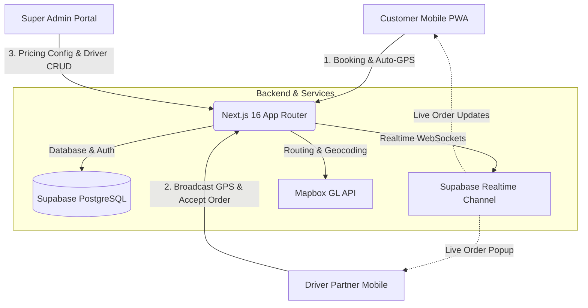

<div align="center">

  

  # 🛵 UTIJEK — Next-Gen Ride-Hailing Platform
  ### *Solusi Mobilitas Pintar Kampus & Kota Berbasis Progressive Web App (PWA)*

  [](https://nextjs.org/)
  [](https://react.dev/)
  [](https://www.typescriptlang.org/)
  [](https://supabase.com/)
  [](https://tailwindcss.com/)
  [](https://www.mapbox.com/)
  [](https://web.dev/progressive-web-apps/)

  <p align="center">
    Platform ride-hailing modern all-in-one yang menghubungkan <b>Customer</b>, <b>Driver Partner</b>, dan <b>Super Admin</b> secara real-time. Dilengkapi fitur pelacakan GPS otomatis, kalkulasi tarif dinamis per kilometer & meter, navigasi rute turn-by-turn, dan negosiasi layanan via Live Chat.
  </p>

  [📱 Buka Aplikasi](http://localhost:3000) &bull; [🚀 Quick Demo](#-kredensial-akses-cepat-demo) &bull; [🌟 Fitur](#-fitur-unggulan) &bull; [🛠️ Panduan Instalasi](#️-panduan-instalasi--setup) &bull; [🗺️ Arsitektur](#-arsitektur-sistem)

</div>

---

## ⚡ 4 Layanan Utama UTIJEK

| Layanan | Ikon | Deskripsi | Target Penggunaan |
| :--- | :---: | :--- | :--- |
| **UTIJEK** | 🛵 | **Ojek Motor Cepat** | Antar jemput penumpang ke kampus, kos, stasiun, atau mall |
| **UTIKAN** | 🍱 | **Pesan Antar Makanan** | Belanja kuliner favorit mahasiswa dengan cepat |
| **UTITIP** | 📦 | **Titip & Kurir Barang** | Kirim dokumen kuliah, paket kilat, dan barang belanjaan |
| **UTIBASING** | 💬 | **Layanan Fleksibel Kustom** | Minta tolong apa saja (fotokopi, print, beli ATK) via negosiasi Live Chat |

---

## 🔑 Kredensial Akses Cepat Demo

Pada halaman login ([`/login`](http://localhost:3000/login)), Anda dapat masuk secara instan menggunakan tombol **⚡ Akses Cepat Demo (1-Click)** atau memasukkan akun berikut:

| Role | Email | Password | Hak Akses & URL Portal |
| :--- | :--- | :--- | :--- |
| 🛡️ **Super Admin** | `admin@utijek.com` | `admin123` | [`/admin`](http://localhost:3000/admin) — Manajemen tarif, verifikasi driver, grafik & transaksi |
| 🛵 **Driver Partner** | `driver@utijek.com` | `driver123` | [`/driver`](http://localhost:3000/driver) — Terima pesanan, switch online GPS, riwayat trip |
| 👤 **Customer** | `customer@utijek.com` | `customer123` | [`/home`](http://localhost:3000/home) — Booking instan, auto GPS jemput, pantau order |
| 🌐 **Customer (Google)** | *Akun Google Anda* | *OAuth 2.0* | Registrasi & Login 1-Klik menggunakan akun Google pribadi |

---

## 🌟 Fitur Unggulan

### 1. 👤 Pengalaman Pemesan (Customer Portal)
- 🎯 **Auto-Detect GPS Pemesan**: Ketika halaman pemesanan dibuka, peta langsung terbang (*fly-to*) dan mengunci posisi GPS perangkat pemesan, lalu mengisi titik jemput otomatis tanpa perlu mengetik.
- 🔎 **Smart Place Autocomplete**: Kolom pencarian titik jemput & antar terintegrasi dengan database lokal Bandar Lampung & kampus Universitas Teknokrat Indonesia (UTI) serta online Mapbox geocoding.
- ⚡ **Popular Quick Chips**: Tombol cepat 1-klik untuk lokasi langganan: *Gerbang Utama UTI*, *Gedung Rektorat*, *GSG Teknokrat*, *Mall Boemi Kedaton (MBK)*, *Stasiun Tanjung Karang*, *RS Advent*, dll.
- 🗺️ **Mode Manual di Peta (Fallback)**: Pelanggan dapat mengetuk titik spesifik di peta jika mencari alamat gang atau jalan kecil.
- 💰 **Kalkulasi Tarif Dinamis**: Biaya otomatis terhitung berdasarkan jarak rute berkendara (*driving distance*) riil dari Mapbox Directions API.
- 💬 **Live Chat Drawer**: Komunikasi langsung dengan driver secara real-time via Supabase WebSocket.

### 2. 🛵 Portal Mitra Pengemudi (Driver Partner)
- 🟢 **Switch Online / Offline Real-time**: Mengatur kesiapan menerima order sekaligus menyiarkan koordinat GPS driver secara periodik ke database.
- 🔔 **Order Popup Notification**: Pop-up interaktif saat pesanan masuk lengkap dengan detail jemput, dropoff, estimasi pendapatan, serta tombol *Terima* / *Tolak*.
- 🧭 **Navigasi Turn-by-Turn**: Peta panduan visual dengan tombol pengubah status (*Menuju Lokasi*, *Tiba di Titik Jemput*, *Mulai Trip*, *Selesaikan Pesanan*).
- 📜 **Riwayat Trip Driver ([`/driver/orders`](http://localhost:3000/driver/orders))**: Rekap komprehensif trip selesai dan dibatalkan beserta rincian pendapatan tiap order.

### 3. 🛡️ Portal Manajemen (Super Admin)
- 📊 **Dashboard Analitik**: Visualisasi grafik tren pesanan 30 hari terakhir, omset harian, total driver aktif, dan statistik pelanggan.
- 👥 **Kelola Mitra Driver ([`/admin/drivers`](http://localhost:3000/admin/drivers))**: Registrasi akun driver baru secara aman (*secure server-side hash*), monitoring status online, plat kendaraan, dan rating.
- 💵 **Manajemen Tarif ([`/admin/pricing`](http://localhost:3000/admin/pricing))**: Pengaturan *Base Fare*, *Tarif per Km*, dan *Tarif per Meter* untuk setiap layanan secara real-time tanpa restart server.
- 📑 **Audit & Rekap Transaksi ([`/admin/transactions`](http://localhost:3000/admin/transactions))**: Filter transaksi berdasarkan driver, kategori layanan, dan rentang periode.
- 📱 **Desain Responsif Mobile**: Navigasi bottom bar & header responsif saat diakses dari smartphone atau tablet.

---

## 🗺️ Arsitektur Sistem



---

## 🛠️ Panduan Instalasi & Setup

### 1. Prasyarat Sistem
Pastikan di komputer Anda sudah terpasang:
- **Node.js** versi 18.18+ atau 20+
- **Git**
- Akun **Supabase** & Token **Mapbox**

### 2. Clone Repository
```bash
git clone https://github.com/HafisYulianto/utijek-app.git
cd utijek-app
```

### 3. Install Dependensi
```bash
npm install
```

### 4. Konfigurasi Environment Variables (`.env.local`)
Buat file `.env.local` di folder root:
```env
NEXT_PUBLIC_SUPABASE_URL=https://your-project.supabase.co
NEXT_PUBLIC_SUPABASE_ANON_KEY=your-anon-or-publishable-key
SUPABASE_SERVICE_ROLE_KEY=your-service-role-secret-key
NEXT_PUBLIC_MAPBOX_TOKEN=pk.your-mapbox-token
NEXT_PUBLIC_APP_URL=http://localhost:3000
```

### 5. Setup Database Supabase
Jalankan file migrasi SQL di **Supabase SQL Editor**:
- Jalankan script yang ada di [`supabase/migrations/001_initial.sql`](supabase/migrations/001_initial.sql).
- Script ini akan membuat skema tabel `profiles`, `driver_profiles`, `pricing_config`, `orders`, `transactions`, `chat_messages`, serta trigger otomatis pembuatan profil user baru.

### 6. Seeding Akun Demo (Opsional)
Jalankan seeder otomatis untuk mengisi akun Super Admin, Driver, dan Customer:
- Kunjungi URL: `http://localhost:3000/api/auth/seed-users` via browser atau Postman.

### 7. Jalankan Server Pengembangan
```bash
npm run dev
```
Buka **[http://localhost:3000](http://localhost:3000)** pada browser Anda.

---

## 📁 Struktur Direktori Proyek

```
utijek-app/
├── public/                     # Static assets, logo UTIJEK, & PWA icons
├── src/
│   ├── app/
│   │   ├── (auth)/login/       # Halaman Login Multi-Role (Google & Email)
│   │   ├── (customer)/         # Portal Customer (Home, Booking, Orders, Profile)
│   │   │   ├── book/[service]/ # Booking interaktif dengan auto-GPS & Mapbox
│   │   │   ├── home/           # Dashboard utama pemesan & pilihan layanan
│   │   │   ├── orders/         # Riwayat pesanan & status aktif
│   │   │   └── profile/        # Profil customer & wallet saldo
│   │   ├── admin/              # Portal Super Admin
│   │   │   ├── drivers/        # CRUD akun mitra pengemudi
│   │   │   ├── pricing/        # Manajemen tarif dinamis
│   │   │   └── transactions/   # Laporan transaksi & filter
│   │   ├── api/                # Route Handlers (Driver CRUD & User Seeder)
│   │   ├── driver/             # Portal Driver Partner
│   │   │   ├── navigation/     # Navigasi rute aktif turn-by-turn
│   │   │   └── orders/         # Riwayat trip pengemudi
│   │   └── globals.css         # Custom utility tokens & Maroon Design System
│   ├── components/
│   │   ├── admin/              # Sidebar & Grafik Analitik Admin
│   │   ├── customer/           # LocationSearchInput, ServiceCard, BottomNav
│   │   ├── driver/             # DriverBottomNav, OnlineToggle, OrderPopup
│   │   ├── map/                # Mapbox LiveMap & marker kustom
│   │   └── ui/                 # Reusable UI (Button, Card, Badge, Modal)
│   ├── hooks/                  # Custom hooks (Realtime Orders, Driver Location)
│   ├── lib/
│   │   ├── data/               # POI Database Lokal UTI & Bandar Lampung
│   │   ├── supabase/           # Client, Server, & Middleware Client
│   │   └── utils/              # Formula harga, jarak, & formatter rupiah
│   └── types/                  # TypeScript Database Definitions
└── supabase/
    └── migrations/             # Migrasi SQL & RLS policies
```

---

## 📱 Instalasi Progressive Web App (PWA)

Aplikasi ini dapat diinstal langsung ke layar utama perangkat (*Home Screen*) tanpa melalui Google Play Store atau Apple App Store:

- **Android (Chrome / Edge)**: Buka browser ➔ Ketuk ikon menu titik tiga (⋮) ➔ Pilih **"Install app"** atau **"Tambahkan ke Layar Utama"**.
- **iOS / iPhone (Safari)**: Buka Safari ➔ Ketuk ikon **Share** (kotak panah ke atas) ➔ Pilih **"Add to Home Screen"**.

---

## 🤝 Kontributor & Pengembang

* **Hafis Yulianto** — *Lead Developer & Architect* &bull; [GitHub Profile](https://github.com/HafisYulianto)
* **Tim UTIJEK** — *Universitas Teknokrat Indonesia*

---

<div align="center">
  <sub>Hak Cipta © 2026 UTIJEK Platform. Dibuat dengan ❤️ untuk kemajuan teknologi transportasi lokal.</sub>
</div>
